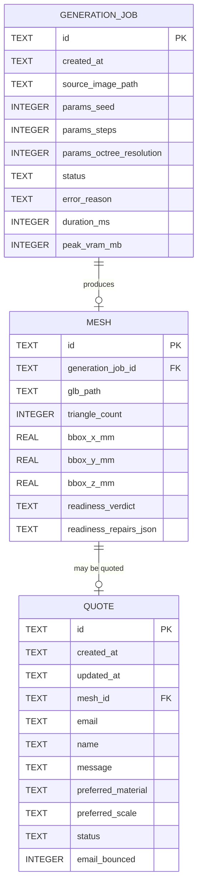
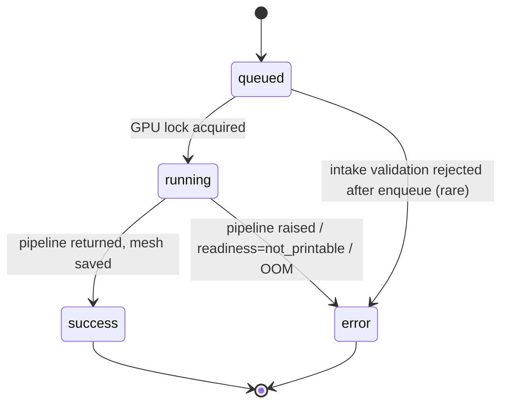
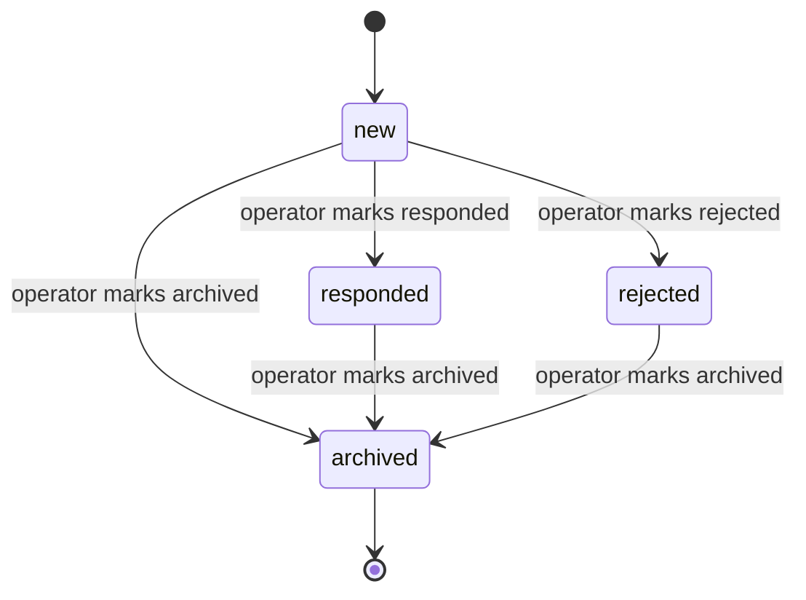

# Phase 1 — Data Model: Imagineer MVP

**Plan**: [`./plan.md`](./plan.md)
**Spec**: [`./spec.md`](./spec.md) — entities defined in §"Key Entities"
**Storage engine**: SQLite single file at `api/imagineer.db` (per Constitution V), via `sqlite3` stdlib (3 entities — below the SQLAlchemy threshold).

## Entity overview



## Tables

All timestamps are ISO-8601 strings (`YYYY-MM-DDTHH:MM:SS.ssssss+00:00`) — `sqlite3` doesn't have a native timestamp type and we want timezone-aware values out of the box. All ids are UUIDv4 strings.

### `generation_jobs`

| Column | SQLite type | Constraints | Notes |
|--------|-------------|-------------|-------|
| `id` | `TEXT` | `PRIMARY KEY` | UUIDv4 |
| `created_at` | `TEXT` | `NOT NULL` | ISO-8601 UTC |
| `source_image_path` | `TEXT` | `NOT NULL` | Relative to `Settings.storage_dir` |
| `params_seed` | `INTEGER` | `NOT NULL` | RNG seed for reproducibility |
| `params_steps` | `INTEGER` | `NOT NULL DEFAULT 30` | Diffusion steps |
| `params_octree_resolution` | `INTEGER` | `NOT NULL DEFAULT 256` | Mesh octree size |
| `status` | `TEXT` | `NOT NULL CHECK (status IN ('queued','running','success','error'))` | See state machine below |
| `error_reason` | `TEXT` | `NULL` | Sanitized customer-facing message; tracebacks go to logs only (NFR-005) |
| `duration_ms` | `INTEGER` | `NULL` | Set when status moves to `success` or `error` |
| `peak_vram_mb` | `INTEGER` | `NULL` | Captured from `torch.cuda.max_memory_allocated()` |

**Indexes**:
- `idx_generation_jobs_created_at` on `created_at` — supports the retention janitor and operator history views.

**State transitions**:



### `meshes`

| Column | SQLite type | Constraints | Notes |
|--------|-------------|-------------|-------|
| `id` | `TEXT` | `PRIMARY KEY` | UUIDv4 |
| `generation_job_id` | `TEXT` | `NOT NULL REFERENCES generation_jobs(id)` | One mesh per successful job |
| `glb_path` | `TEXT` | `NOT NULL` | Relative to `Settings.storage_dir` |
| `triangle_count` | `INTEGER` | `NOT NULL` | Reported via `len(trimesh.faces)` |
| `bbox_x_mm` | `REAL` | `NOT NULL` | Native scale; assumes the GLB's units are mm |
| `bbox_y_mm` | `REAL` | `NOT NULL` | |
| `bbox_z_mm` | `REAL` | `NOT NULL` | |
| `readiness_verdict` | `TEXT` | `NOT NULL CHECK (readiness_verdict IN ('printable','auto_repaired','not_printable'))` | Drives FR-033 quote-button gating |
| `readiness_repairs_json` | `TEXT` | `NOT NULL DEFAULT '[]'` | JSON array of `{operation, count}` entries — what `trimesh` repaired |

**Indexes**: none beyond the implicit `id` PK and the FK on `generation_job_id`.

**Validation rules**:

- `readiness_verdict='auto_repaired'` is only valid if `readiness_repairs_json != '[]'`. Enforced in application code; not as a CHECK because the JSON inspection is awkward in SQLite.
- `bbox_*_mm` must be `> 0`. Enforced via `CHECK (bbox_x_mm > 0 AND bbox_y_mm > 0 AND bbox_z_mm > 0)`.

### `quotes`

| Column | SQLite type | Constraints | Notes |
|--------|-------------|-------------|-------|
| `id` | `TEXT` | `PRIMARY KEY` | UUIDv4 — also serves as the customer-facing quote reference |
| `created_at` | `TEXT` | `NOT NULL` | ISO-8601 UTC |
| `updated_at` | `TEXT` | `NOT NULL` | Bumped on every operator status change |
| `mesh_id` | `TEXT` | `NOT NULL REFERENCES meshes(id)` | The mesh the customer wants quoted |
| `email` | `TEXT` | `NOT NULL` | Validated via Pydantic `EmailStr` |
| `name` | `TEXT` | `NULL` | Optional |
| `message` | `TEXT` | `NULL` | Optional free-text from the customer |
| `preferred_material` | `TEXT` | `NULL` | Free-text in v1 (no enum yet — operator interprets) |
| `preferred_scale` | `TEXT` | `NULL` | Free-text in v1 (e.g., "1:32", "actual size", "as small as possible") |
| `status` | `TEXT` | `NOT NULL DEFAULT 'new' CHECK (status IN ('new','responded','archived','rejected'))` | Operator-managed |
| `email_bounced` | `INTEGER` | `NOT NULL DEFAULT 0` | 0 = no, 1 = yes — flagged when the confirmation email bounces (FR-044) |

**Indexes**:
- `idx_quotes_status_created` on `(status, created_at DESC)` — supports the operator dashboard's primary view "show me everything `new`, newest first".
- `idx_quotes_mesh_id` on `mesh_id` — supports the back-link from a mesh to its quote (rare, but cheap).

**State transitions**:



`archived` is the terminal state for retention purposes. The retention janitor (NFR-007) deletes quote rows + their attached files 90 days after they enter `archived`.

## Schema-init script

The schema lives in `api/app/db.py` as a single `SCHEMA_SQL` constant applied via `executescript()` on app startup. No migration tool yet (Constitution V). Idempotent: every CREATE uses `IF NOT EXISTS`.

```sql
CREATE TABLE IF NOT EXISTS generation_jobs (
    id TEXT PRIMARY KEY,
    created_at TEXT NOT NULL,
    source_image_path TEXT NOT NULL,
    params_seed INTEGER NOT NULL,
    params_steps INTEGER NOT NULL DEFAULT 30,
    params_octree_resolution INTEGER NOT NULL DEFAULT 256,
    status TEXT NOT NULL CHECK (status IN ('queued','running','success','error')),
    error_reason TEXT,
    duration_ms INTEGER,
    peak_vram_mb INTEGER
);
CREATE INDEX IF NOT EXISTS idx_generation_jobs_created_at ON generation_jobs(created_at);

CREATE TABLE IF NOT EXISTS meshes (
    id TEXT PRIMARY KEY,
    generation_job_id TEXT NOT NULL REFERENCES generation_jobs(id),
    glb_path TEXT NOT NULL,
    triangle_count INTEGER NOT NULL,
    bbox_x_mm REAL NOT NULL CHECK (bbox_x_mm > 0),
    bbox_y_mm REAL NOT NULL CHECK (bbox_y_mm > 0),
    bbox_z_mm REAL NOT NULL CHECK (bbox_z_mm > 0),
    readiness_verdict TEXT NOT NULL CHECK (readiness_verdict IN ('printable','auto_repaired','not_printable')),
    readiness_repairs_json TEXT NOT NULL DEFAULT '[]'
);

CREATE TABLE IF NOT EXISTS quotes (
    id TEXT PRIMARY KEY,
    created_at TEXT NOT NULL,
    updated_at TEXT NOT NULL,
    mesh_id TEXT NOT NULL REFERENCES meshes(id),
    email TEXT NOT NULL,
    name TEXT,
    message TEXT,
    preferred_material TEXT,
    preferred_scale TEXT,
    status TEXT NOT NULL DEFAULT 'new' CHECK (status IN ('new','responded','archived','rejected')),
    email_bounced INTEGER NOT NULL DEFAULT 0
);
CREATE INDEX IF NOT EXISTS idx_quotes_status_created ON quotes(status, created_at DESC);
CREATE INDEX IF NOT EXISTS idx_quotes_mesh_id ON quotes(mesh_id);
```

## On-disk storage layout

`Settings.storage_dir` (default `api/storage/`, gitignored). Files keyed by date and UUID:

```text
api/storage/
└── 2026/
    └── 05/
        └── 05/
            ├── 6f3d7c4a-... .png    (source image)
            └── 6f3d7c4a-... .glb    (generated mesh)
```

The same UUID is used for the source image and its mesh when they belong to the same `GenerationJob` — easier to correlate by hand. The DB stores `source_image_path` and `glb_path` as `2026/05/05/<uuid>.<ext>` (relative to `storage_dir`), so a future move to S3 only changes the resolver in `storage.py`.

## Retention janitor

Runs at app startup (NFR-007 + R8 in `research.md`):

| Subject | Retention rule | Effect |
|---------|----------------|--------|
| Anonymous `generation_jobs` (no associated quote) older than `RETENTION_ANONYMOUS_HOURS` (default 24 h) | Delete the row, the linked mesh row, and both files on disk. | Frees storage; keeps logs (NFR-007). |
| `quotes` in `archived` state for more than `RETENTION_ARCHIVED_DAYS` (default 90 d) | Delete the quote, the mesh, the generation_job, and both files. | Closes the retention loop (NFR-007). |
| `quotes` in `rejected` state | Same as `archived` — terminal, retention applies. | |
| `generation_jobs` with `status='error'` older than `RETENTION_ANONYMOUS_HOURS` | Delete the row + source image. | Errors don't produce a mesh, so no mesh row to clean up. |

Generation logs (`generation_jobs` rows, after files are deleted) are kept for 1 year for capacity planning — this is implemented by **not** deleting the row in the anonymous case until the 1-year mark; the file paths get nulled instead. (Decision: ship v1 with the simpler "delete row + files together at 24 h"; revisit if capacity-planning data turns out to be needed before we have logs from elsewhere.)

## Validation rules — cross-table

These are enforced in application code (Pydantic + service layer), not in SQL:

- A quote can only be created for a mesh whose `readiness_verdict` is `printable` or `auto_repaired` (FR-033). Enforced in `routers/quote.py`.
- A mesh download is allowed regardless of readiness verdict (FR-032). Enforced in `routers/generation.py`.
- A quote's `email` must be a valid email per Pydantic `EmailStr`.
- `preferred_material` and `preferred_scale` are free-text in v1 (no enum) — the operator interprets. Length bounded to 200 chars to avoid abuse.
- `message` length bounded to 2000 chars.
